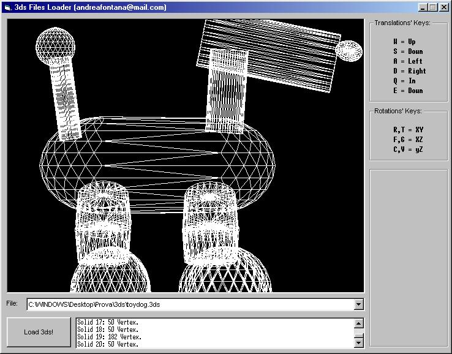



## A 3dStudio File \(\.3ds\) Reader\!\!\! No dx all vb source\!

### Description

This code allow you to show 3ds file in a picturebox without dll, ocx , directX, glide ecc...All vb code! And it's flicker free! You can translate and rotate the solid!
 
### More Info
 

             |
---                |---
**Submitted On**   |2001-10-07 00:28:32
**By**             |[A\. Fontana](https://github.com/Planet-Source-Code/PSCIndex/blob/master/ByAuthor/a-fontana.md)
**Level**          |Advanced
**User Rating**    |4.8 (125 globes from 26 users)
**Compatibility**  |VB 5\.0, VB 6\.0
**Category**       |[Graphics](https://github.com/Planet-Source-Code/PSCIndex/blob/master/ByCategory/graphics__1-46.md)
**World**          |[Visual Basic](https://github.com/Planet-Source-Code/PSCIndex/blob/master/ByWorld/visual-basic.md)
**Archive File**   |[A\_3dStudio1068167162002\.zip](https://github.com/Planet-Source-Code/a-fontana-a-3dstudio-file-3ds-reader-no-dx-all-vb-source__1-27856/archive/master.zip)

